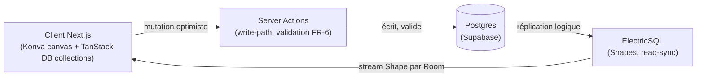
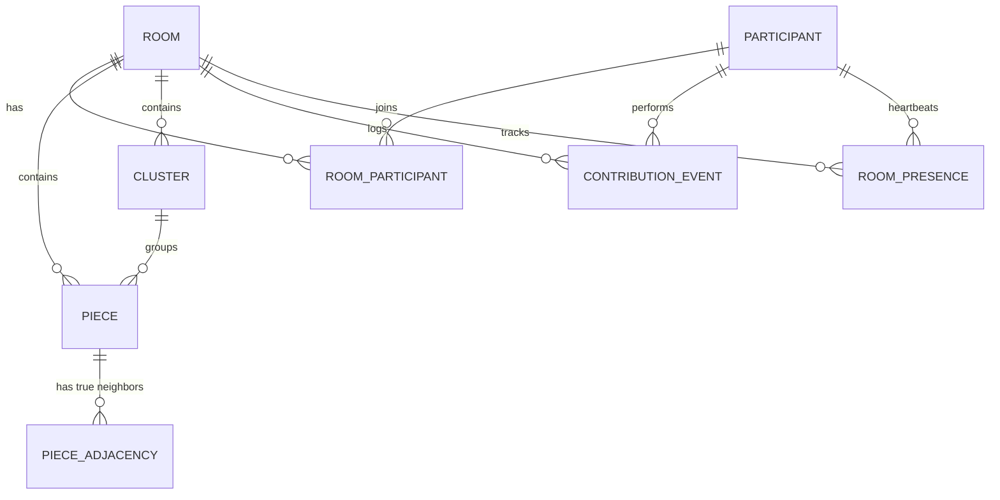

# Architecture Spine — Jigsaw

## Design Paradigm

**Local-first / optimistic-sync.** Le client tient un état réactif local (TanStack DB collections) qui reflète Postgres, synchronisé en lecture via ElectricSQL (Shapes scopées par Room). Toute écriture qui compte passe par un chemin serveur autoritaire (Server Actions Next.js), jamais par un client direct vers Postgres.



## Invariants & Rules

### AD-1 — Sync engine comme seule voie de lecture partagée

- **Binds:** all
- **Prevents:** logique de synchronisation ad-hoc réinventée par écran ; état divergent entre clients d'un même Room.
- **Rule:** Tout état partagé (Room, Piece, Cluster, ContributionEvent) est persisté dans Postgres et synchronisé aux clients exclusivement via une Shape ElectricSQL scopée au Room. Aucun polling ni canal de sync parallèle. La mutation optimiste du client émetteur lui-même est réconciliée exclusivement par la prochaine mise à jour de la Shape Electric pour cette ligne — la valeur de retour d'une Server Action ne doit jamais être appliquée directement à la collection TanStack DB, même par le client qui a émis la mutation. Un seul chemin de confirmation, sans exception.

### AD-2 — Serveur autoritaire pour toute écriture

- **Binds:** création de Room, placement de Piece, formation/fusion de Cluster
- **Prevents:** triche ou incohérence de validation côté client ; deux clients qui commitent des écritures conflictuelles sans arbitre.
- **Rule:** Toute mutation passe par une Server Action Next.js, exécutée avec la clé de service Postgres. Le rôle `anon`/`authenticated` de Supabase n'a **aucun droit INSERT/UPDATE/DELETE, sur aucune table de domaine, sans exception** (Room, Piece, PieceAdjacency, Cluster, ContributionEvent, RoomPresence, RoomParticipant) — RLS deny-by-default à l'échelle du schéma, pas seulement sur les trois mutations citées ci-dessus. Le SDK client Supabase reste utilisable uniquement pour l'Auth et la génération d'URLs de Storage ; jamais pour `.from(table).insert/update/delete()`. Aucun client (web ou futur natif) ne peut donc écrire directement dans Postgres, même par erreur, raccourci, ou nouvelle fonctionnalité qui semblerait "hors du périmètre" des trois mutations nommées. La validation FR-6 (correspondance réelle des découpes) ne s'exécute que côté serveur ; le client peut prédire optimistiquement le résultat mais ne fait jamais autorité.

### AD-3 — Graphe d'adjacence précalculé à la création du Room

- **Binds:** Piece, PieceAdjacency, intégration au Frame, formation de Cluster
- **Prevents:** recalcul de géométrie (languette/encoche) à chaque tentative de pose ; désaccord client/serveur sur ce qui "correspond réellement".
- **Rule:** À la création d'un Room, un algorithme de découpe déterministe (graine fixe) génère une fois pour toutes la `PieceShape` (Corner/Edge/Interior) et le jeu de vrais voisins de chaque Piece, persistés dans `PieceAdjacency`. La validation FR-6 est une consultation de ce graphe, jamais un calcul géométrique à la volée. Les tuiles image générées sont écrites dans Supabase Storage (bucket `piece-tiles`, un dossier par `Room.id`) ; `Piece.imageAssetRef` référence le chemin de la tuile correspondante.

  Une ligne `Cluster` n'existe en base que si ≥ 2 Pieces sont réellement fusionnées (règle de correspondance FR-4) ; une Piece isolée a `cluster_id = NULL` et n'est jamais comptée comme un Îlot dans les statistiques FR-21 — `Cluster.size = 1` n'est jamais un état persisté. Une fusion Piece→Cluster ou Cluster→Cluster est une **unique transaction Postgres atomique** (jamais une séquence d'appels par pièce pilotée côté client) ; aucun client n'observe un Cluster à moitié fusionné via la Shape Electric. La fusion ne réussit que si **toutes** les paires de bords en contact le long de la frontière correspondent réellement (ET logique, tolérance zéro pour un faux contact partiel) — pas seulement une paire parmi plusieurs.

### AD-4 — Vocabulaire : specs en français, code en anglais, table de correspondance figée

- **Binds:** all (entités, fichiers, identifiants)
- **Prevents:** dérive où différents contributeurs traduisent différemment le même terme métier.
- **Rule:** Convention de projet délibérée (pas un oubli) : les specs (PRD, DESIGN.md, EXPERIENCE.md) restent en français, le code en anglais. Les identifiants de code utilisent la table de correspondance ci-dessous, verbatim, sans synonyme introduit ailleurs :

  | Terme spec (FR) | Terme code (EN) |
  | --- | --- |
  | Salon | `Room` |
  | Cadre | `Frame` |
  | Espace infini | `Canvas` |
  | Îlot | `Cluster` |
  | Invité | `Guest` (`Participant.isGuest`) |
  | Participant / Participant inscrit | `Participant` |
  | Forme élémentaire | `PieceShape` (`Corner` / `Edge` / `Interior`) |
  | Cadre complet (événement) | `Room.status = 'completed'` (transition unique, déclenchée en Server Action quand `pieces placées = pieces totales`) |
  | Historique des contributeurs | Requête sur `ContributionEvent` (pas d'entité séparée) |
  | Présence en direct | `RoomPresence` (cf. AD-7) |
  | Types d'événement `ContributionEvent.type` | Enum fermé : `'piece_placed' \| 'cluster_formed' \| 'cluster_merged' \| 'room_completed'` — aucun autre littéral ne doit être introduit ailleurs. |
  | Gate de création de Room (FR-17) | Exactement `Participant.isGuest === false` ; aucun autre indicateur (ex. email vérifié) n'est requis en V1 sauf amendement du PRD. |

### AD-5 — Rendu du Canvas via Konva uniquement

- **Binds:** UI du Room (Canvas, Frame, Piece, Cluster)
- **Prevents:** mélange de paradigmes de rendu (certains écrans en Konva, d'autres en Canvas2D/WebGL fait main).
- **Rule:** Tout rendu du Canvas (pan/zoom, drag de Piece/Cluster) passe par Konva.js via `react-konva`. Aucun accès direct à l'API Canvas2D ou WebGL hors de cette couche. Le contenu non-canvas ancré spatialement au Canvas (chips d'avatar, annonces `aria-live`) sort volontairement de ce binding pour rester accessible aux lecteurs d'écran (Konva n'est pas nativement accessible), mais passe obligatoirement par un utilitaire de projection de coordonnées partagé (`lib/canvas/project-to-screen.ts`) plutôt qu'une réimplémentation par fonctionnalité.

### AD-6 — Résolution de conflit : dernier-arrivé-gagne au niveau de la transaction

- **Binds:** placement de Piece, formation/fusion de Cluster (FR-7)
- **Prevents:** deux builders qui implémentent chacun une stratégie de résolution différente (l'un un rejet par verrou optimiste, l'autre un écrasement silencieux) — laissé ouvert par le PRD, non tranché par AD-2 seul.
- **Rule:** Chaque Server Action mutante vérifie un contrôle de concurrence optimiste (colonne `version`/`updated_at` monotone sur la ligne ciblée) avant d'écrire. En cas de désaccord (la ligne a changé depuis la lecture du client), l'action **n'applique pas** la mutation et retourne `{ error: { code: 'STALE_WRITE' } }` — jamais un écrasement silencieux (last-write-wins non qualifié est interdit). Côté client, sur `STALE_WRITE` : la mutation optimiste locale est abandonnée (jamais de nouvelle tentative automatique qui écraserait l'état serveur), en attendant la prochaine mise à jour de la Shape Electric pour refléter la vérité. Pas d'écran "conflit" dédié — cohérent avec le positionnement collaboratif (pas compétitif) du produit en V1. Contrainte NFR-1 : au rejet, le client doit toujours afficher une transition visible depuis la position optimiste vers la dernière position confirmée connue — jamais une simple disparition de la pièce, qui violerait NFR-1 ("pas de perte de pièce"). L'animation/l'easing exacts restent un détail d'implémentation.

### AD-7 — Présence via le même canal de synchronisation

- **Binds:** FR-12 (présence en direct)
- **Prevents:** l'ajout d'un second canal temps réel (ex. un système de présence ad-hoc type WebSocket séparé) qui contredirait AD-1 et doublerait la surface à maintenir.
- **Rule:** La présence est un état persistant comme les autres : une table `RoomPresence` (`participant_id`, `last_seen_at`) mise à jour par une Server Action de heartbeat (appelée périodiquement par le client), synchronisée aux autres participants via la même Shape Electric que le reste du Room. Aucun canal de présence séparé n'est introduit.

## Consistency Conventions

| Concern | Convention |
| --- | --- |
| Naming (entities, files, interfaces, events) | Vocabulaire anglais figé par AD-4 ; pas de traduction alternative. |
| Data & formats (ids, dates, error shapes, envelopes) | IDs = UUID v4 (`gen_random_uuid()` Postgres). Dates = `timestamptz` Postgres / ISO 8601 au transport. Erreurs de Server Action : enveloppe `{ error: { code, message } }`. |
| State & cross-cutting (mutation, errors, logging, config, auth) | Mutation uniquement via Server Actions (AD-2). Auth via Supabase Auth (JWT) ; un `Guest` est une session sans compte, promue en `Participant` authentifié sur inscription (cf. PRD FR-15 Consequences — rattachement rétroactif). Config par variables d'environnement, une valeur par environnement (dev/preview/production). Observabilité V1 : tableaux de bord natifs Vercel + Supabase, pas d'outil dédié (décision, pas un oubli). `error.code` vit dans un registre de constantes partagé unique, pas de chaînes libres par site d'appel. |

## Stack

<!-- Versions majeures actuelles au moment de la rédaction — à re-vérifier et figer au bootstrap du repo. -->

| Name | Version |
| --- | --- |
| Next.js (App Router) | 16.x (15.x est passé en maintenance) |
| React | 19.x |
| TypeScript | 5.x |
| TanStack DB | dernière stable — pré-1.0, écosystème jeune : risque de maturité accepté, cf. Deferred |
| ElectricSQL | **≥ 1.5.0 obligatoire** (CVE-2026-40906, injection SQL critique sur `/v1/shape`, corrigée en 1.5.0) ; intégration `@tanstack/electric-db-collection` |
| Konva.js + react-konva | dernière stable |
| Tailwind CSS + shadcn/ui | dernière stable (déjà fixé par DESIGN.md) |
| Supabase (Postgres, Auth, Storage) | managé, dernière version de plateforme (vérifier au bootstrap que le projet n'est pas sur une version Postgres en fin de support). Connexion **directe** (pas le pooler) requise pour la réplication logique Electric — nécessite IPv6 ou l'add-on IPv4 (plan Pro/Team). |
| Capacitor | dernière stable (wrapper mobile). Charge l'origine Next.js déployée (Vercel) à distance dans la WebView — pas d'export statique — condition nécessaire pour qu'AD-2 tienne aussi sur mobile (Server Actions/RSC exigent un serveur actif). |
| Hébergement web | Vercel |

## Structural Seed



```text
{root}/
  app/                 # Next.js App Router — pages + Server Actions colocalisées
    room/[id]/         # Surface Room (Canvas, Frame, Cluster)
    create/            # Création de Room (FR-17 à FR-20)
    stats/[roomId]/    # Statistiques du Room
  components/
    canvas/            # Composants Konva (Piece, Cluster, Frame, boutons flottants)
    ui/                # shadcn/ui, non modifiés hors surcharge DESIGN.md
  lib/
    piece-cutting/      # Service de découpe déterministe (AD-3)
    validation/         # Règle FR-6 (correspondance des découpes) + verification concurrence (AD-6)
    auth/               # Gate isGuest/FR-17 — point d'import unique, jamais réimplémenté inline
    canvas/             # project-to-screen.ts — projection de coordonnées Konva -> DOM (AD-5)
    db/                 # Collections TanStack DB, config Electric Shapes
  supabase/
    migrations/         # Schéma Postgres versionné
```

Toute Server Action mutante, quelle que soit la zone fonctionnelle (y compris les écritures `ContributionEvent` pour les statistiques/historique), importe son autorisation depuis `lib/auth/` et sa validation métier depuis `lib/validation/` — aucune réimplémentation inline de la règle FR-6 ou de la vérification `isGuest` ailleurs dans `app/**`.

## Deferred

- Paramètres exacts de l'algorithme de découpe (courbure des languettes, tolérance) — détail d'implémentation du service `piece-cutting`.
- Seuil de proximité déclenchant la vérification d'adjacence entre deux pièces (PRD §4.2 FR-6, assumption explicite) — paramètre à fixer en implémentation.
- Comportement hors-ligne détaillé (cf. PRD, assumption UX) — au-delà du rollback optimiste générique de TanStack DB. **Dépend du contrat AD-6** (`STALE_WRITE`) : ne pas concevoir la stratégie de rejeu offline (séquentiel vs. coalescé) avant que ce contrat serve de référence commune, sous peine que deux epics supposent des sémantiques serveur différentes.
- Modération des photos importées (PRD Open Question #2).
- Cohérence résolution image / nombre de pièces demandé (PRD Open Question #3).
- Habillage visuel exact du rollback (easing, durée) au-delà de la contrainte NFR-1 fixée par AD-6 (transition obligatoire, jamais une disparition).
- Séparation exacte des projets Supabase dev/prod (projet séparé vs schéma isolé) — arbitrage coût/complexité pour plus tard.
- Mode Battle (V2, compétitif) et son bonus lié à l'intégration d'Îlot — hors scope V1 (cf. PRD Non-Goals).
- Réécriture native (Flutter ou autre) — permise par le découplage backend (cf. PRD §7) mais non planifiée.
- Maturité des dépendances (TanStack DB pré-1.0, ElectricSQL petite équipe/une levée de fonds) — risque accepté pour la vitesse d'itération solo-dev ; à surveiller, pas de plan de repli écrit pour l'instant.
